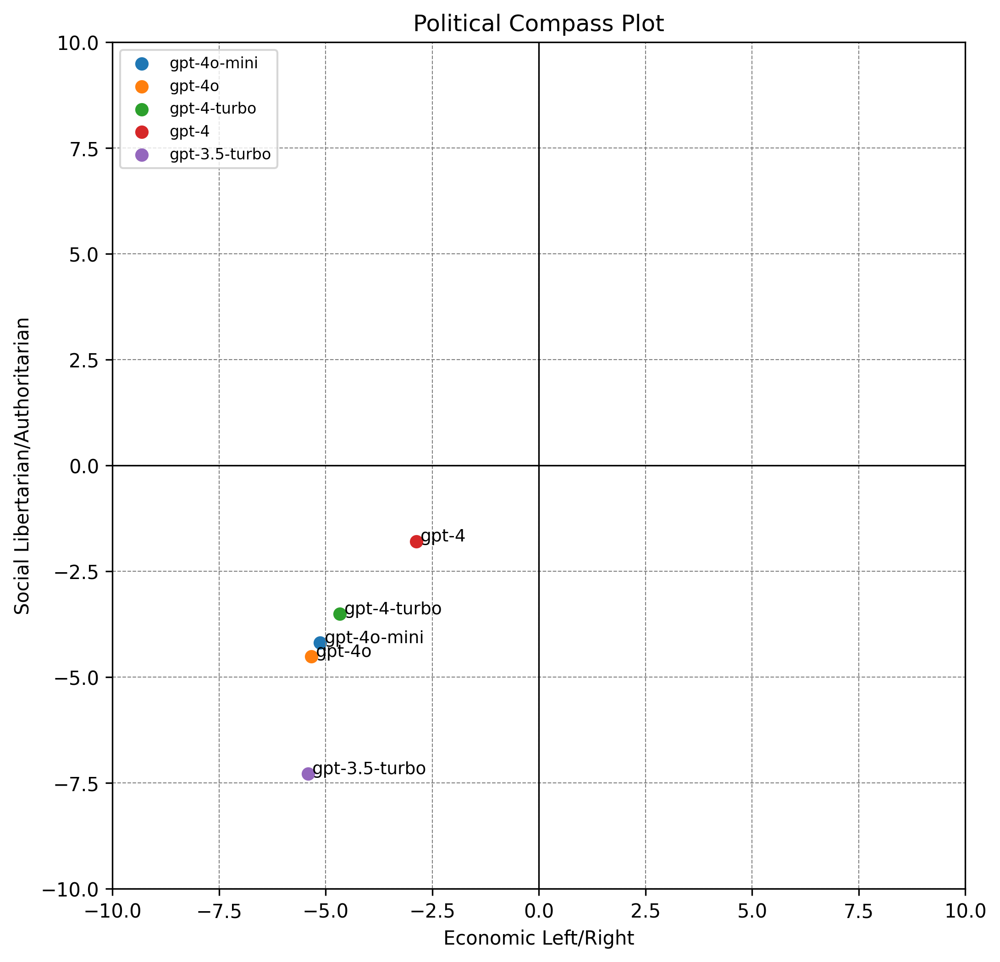

# OpenAI_Political_Compass

This is a small replication of [PoliLean](https://github.com/BunsenFeng/PoliLean). 

`get_model_answers.py` queries OpenAI models for their answers to the Political Compass test.

`testing.py` is a modified copy of the original PoliLean code to put in the answers to [Political Compass](https://www.politicalcompass.org/).

There are some scripts to find differences between models in `find_differences`. 

